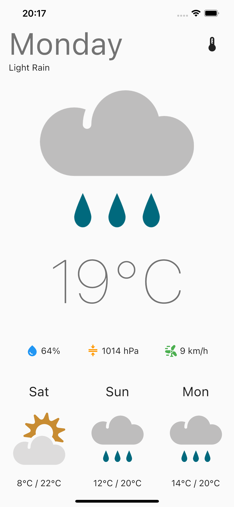
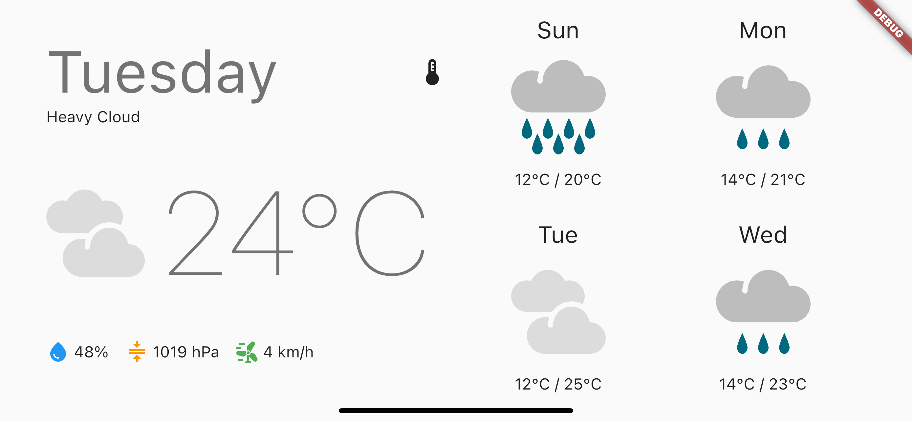

# Weather Application

This project is a weather application and the location is hard-coded to fetch weather data from London.\
Regarding the state management, this application uses Bloc/Cubit.

Build using the latest [Flutter](https://flutter.dev) stable version (v.3.0.0).

This application was tested on iPhone 13 Pro Max (Emulator) using iOS 15.4.

## Features

- [x] Fetch weather data from the [MetaWeather API](https://www.metaweather.com/api)
- [x] Portrait and landscape layouts
- [x] Toggle between Celsius and Fahrenheit
- [x] Pull to refresh

## Screenshots

